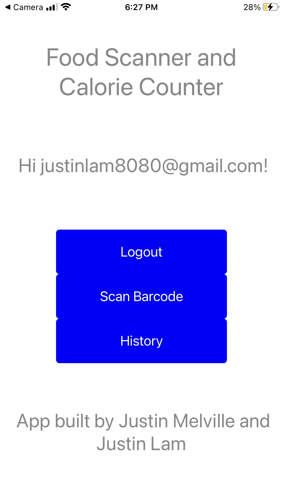

# Calorie App
Authors: Justin Lam, Justin Melville

Date: 2021-08-13
-----

## Summary

## Solution Design

This app was designed for EC463, Senior Design. Its purpose is for a user to be able to track their daily nutrition totals. It accomplishes this by scanning barcodes using the FDC (FoodData Center) RESTful API. This API is only compatible with UPC barcodes. Scanning another barcode will not return results from our app. After scanning, users can view the nutritional information (calories, fats, & sugars) of the scanned product. They can also adjust the default portion size to better match the level of consumption. After scanning at least one item, users can then view their nutrition totals as well as the names and info of individual products by navigating to the history page.

### Loading Screen

This screen only appears in-between screens, such as when a user has entered their email and password and are waiting for the backend to authenticate their information.

### Sign-Up/Login Screen
For the sign-up and login screens, the user needs to be mindful if they've already created an account with our app before. If they do not have an account, they can enter their email and a new password on the sign-up page, and then press on the create account button. This will create a new user in Firebase backend service. If you already have an account, instead navigate to the login page where you can enter a previously-used email along with the corresponding password. Whether signing up or logging in, users will be brought to the main page of the app.

### Main Menu
zzzzzzzzzzzzzzzzzzzzzzzzzzzzzzzzzzzzzzzzzzzzzzzzzzzzzzzzzzzzzzzzzzzzzzzzzzzzzzzzzzzzzzzzzzzzzzzzzzzzzzzzzzzzzzzzzzzzzzzzzzzzzzzzzzzzzzzzzzzzzzzzzzzzzzzzzzzzzzzzzzzzzzzzzzzzzzzzzzzzzzzzzzzzzzzzzzzzzzzzzzzzzzzzzzzzzzzzzzzzzzzzzzzzzzzzzzzzzzzzzzzzzzzzzzzzzzzzzzzzzzzzzzzzzzzzzzzzzzzzzzzzzzzzzzzzzzzzzzzzzzzzzzzzzzzzzzzzzzzzzzzzzzzzzzzzzzzzzzzzzzzzzzzzzzzzzzzzzzzzzzzzzzzzzzzzzzz

### Barcode Scanner
zzzzzzzzzzzzzzzzzzzzzzzzzzzzzzzzzzzzzzzzzzzzzzzzzzzzzzzzzzzzzzzzzzzzzzzzzzzzzzzzzzzzzzzzzzzzzzzzzzzzzzzzzzzzzzzzzzzzzzzzzzzzzzzzzzzzzzzzzzzzzzzzzzzzzzzzzzzzzzzzzzzzzzzzzzzzzzzzzzzzzzzzzzzzzzzzzzzzzzzzzzzzzzzzzzzzzzzzzzzzzzzzzzzzzzzzzzzzzzzzzzzzzzzzzzzzzzzzzzzzzzzzzzzzzzzzzzzzzzzzzzzzzzzzzzzzzzzzzzzzzzzzzzzzzzzzzzzzzzzzzzzzzzzzzzzzzzzzzzzzzzzzzzzzzzzzzzzzzzzzzzzzzzzzzzzzzzz

### Info Screen
zzzzzzzzzzzzzzzzzzzzzzzzzzzzzzzzzzzzzzzzzzzzzzzzzzzzzzzzzzzzzzzzzzzzzzzzzzzzzzzzzzzzzzzzzzzzzzzzzzzzzzzzzzzzzzzzzzzzzzzzzzzzzzzzzzzzzzzzzzzzzzzzzzzzzzzzzzzzzzzzzzzzzzzzzzzzzzzzzzzzzzzzzzzzzzzzzzzzzzzzzzzzzzzzzzzzzzzzzzzzzzzzzzzzzzzzzzzzzzzzzzzzzzzzzzzzzzzzzzzzzzzzzzzzzzzzzzzzzzzzzzzzzzzzzzzzzzzzzzzzzzzzzzzzzzzzzzzzzzzzzzzzzzzzzzzzzzzzzzzzzzzzzzzzzzzzzzzzzzzzzzzzzzzzzzzzzzz

### History Screen
zzzzzzzzzzzzzzzzzzzzzzzzzzzzzzzzzzzzzzzzzzzzzzzzzzzzzzzzzzzzzzzzzzzzzzzzzzzzzzzzzzzzzzzzzzzzzzzzzzzzzzzzzzzzzzzzzzzzzzzzzzzzzzzzzzzzzzzzzzzzzzzzzzzzzzzzzzzzzzzzzzzzzzzzzzzzzzzzzzzzzzzzzzzzzzzzzzzzzzzzzzzzzzzzzzzzzzzzzzzzzzzzzzzzzzzzzzzzzzzzzzzzzzzzzzzzzzzzzzzzzzzzzzzzzzzzzzzzzzzzzzzzzzzzzzzzzzzzzzzzzzzzzzzzzzzzzzzzzzzzzzzzzzzzzzzzzzzzzzzzzzzzzzzzzzzzzzzzzzzzzzzzzzzzzzzzzzz

## Sketches and Photos

Loading Screen:

Sign Up Screen:

Login Screen

Main Menu:

Barcode Scanner:

Info Screen:

History Screen:

FDC Request:

Firebase Real Time:

## Supporting Artifacts
Youtube Link

Storyboard:

Flowchart for video:

Time log

Code:

## Modules, Tools, Source Used Including Attribution

ESP32,
LED Lights,

## References
https://www.w3schools.com/tags/att_form_method.asp
-----
